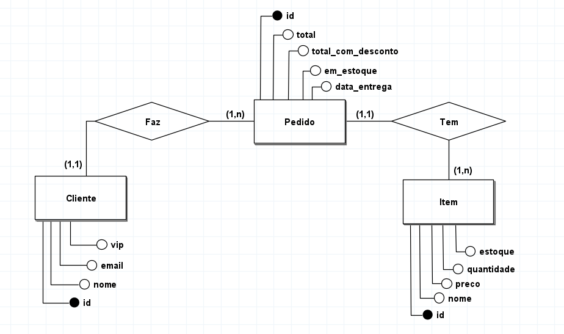
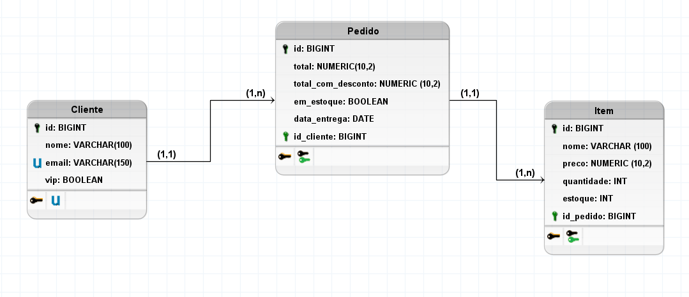

# Desafio Klock

Este projeto consiste em uma API RESTful desenvolvida em **Java com Spring Boot**, que simula o fluxo completo de **processamento de pedidos**, incluindo:

- Cadastro e gerenciamento de clientes
- Cálculo de valores totais e com desconto
- Verificação de estoque
- Definição de data de entrega
- Envio de notificações
- Tratamento de exceções personalizadas
- Documentação via Swagger
- Testes unitários com JUnit e Mockito

---

## 🎥 Demonstração em Vídeo

👉 *Assista à explicação e execução do sistema no vídeo abaixo:*  
📺 [🔗 Link para o vídeo (YouTube)](https://youtu.be/tc9_roAXIsQ)

---

## 🧠 Modelos do Banco de Dados

### 📘 Modelo Conceitual

  
*Diagrama conceitual das entidades e seus relacionamentos.*

### 🗃️ Modelo Lógico

  
*Representação lógica das tabelas, chaves primárias e estrangeiras.*


---

## 🚀 Como executar o projeto

### Pré-requisitos:

- Java 17+
- Maven 3.8+
- Git
- IDE (IntelliJ, VS Code, Eclipse...)

### Passo a passo:

```bash
# Clone o repositório
git clone https://github.com/seu-usuario/seu-repositorio.git
cd seu-repositorio

# Execute os testes
mvn test

# Suba a aplicação
mvn spring-boot:run
```

---

## 📌 Endpoints Principais

### **Cliente**
- **GET** `/clientes`  
  Retorna a lista de todos os clientes cadastrados.

- **GET** `/clientes/{id}`  
  Retorna um cliente específico com base no ID informado.

- **POST** `/clientes`  
  Cadastra um novo cliente no sistema.

- **PUT** `/clientes/{id}`  
  Atualiza os dados de um cliente existente com base no ID.

- **DELETE** `/clientes/{id}`  
  Remove um cliente existente com base no ID informado.

---

### **Pedido**
- **POST** `/pedidos`  
  Cadastra um novo pedido no sistema.

- **PUT** `/pedidos/{id}`  
  Atualiza os dados de um pedido existente com base no ID.

---

### 🔍 **Swagger**
A documentação Swagger está disponível em (durante execução do projeto):  
👉 [http://localhost:8080/swagger-ui.html](http://localhost:8080/swagger-ui.html)

---

## ✍️ Autor
Desenvolvido por Cicero Brunno das Neves Pereira

📧 Email: cicerobrnn111@gmail.com <br>
🔗 LinkedIn: [brunno-pereira-dev](http://www.linkedin.com/in/brunno-pereira-dev)


